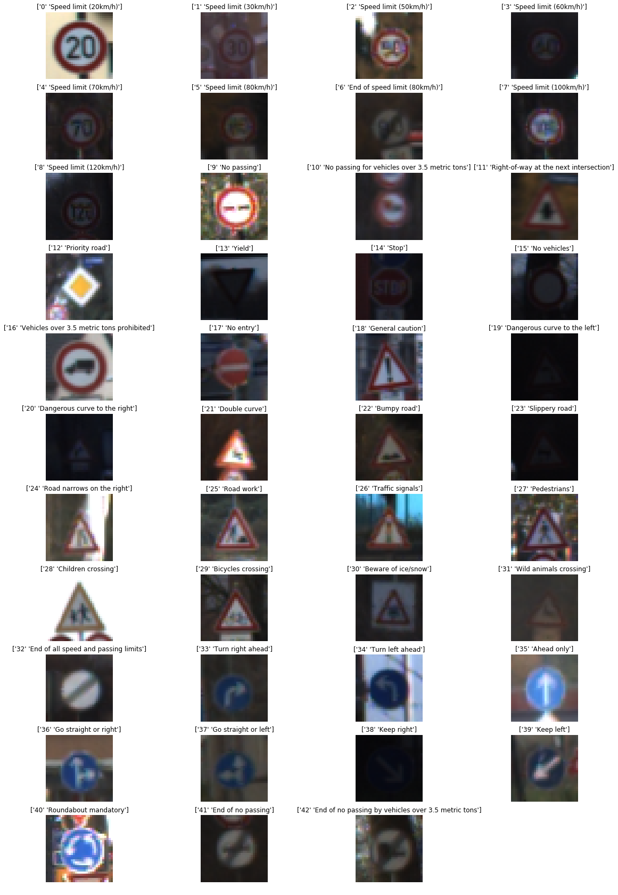
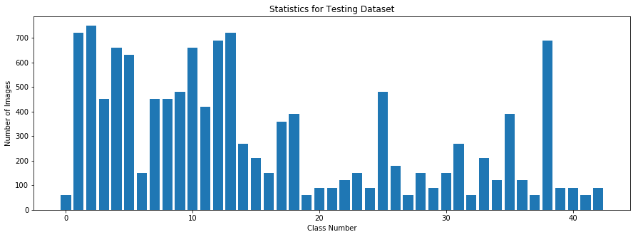
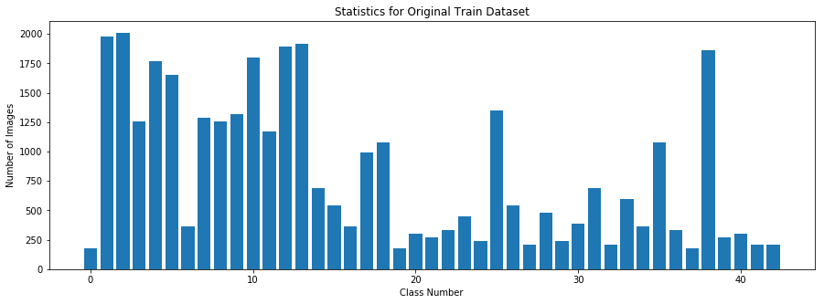
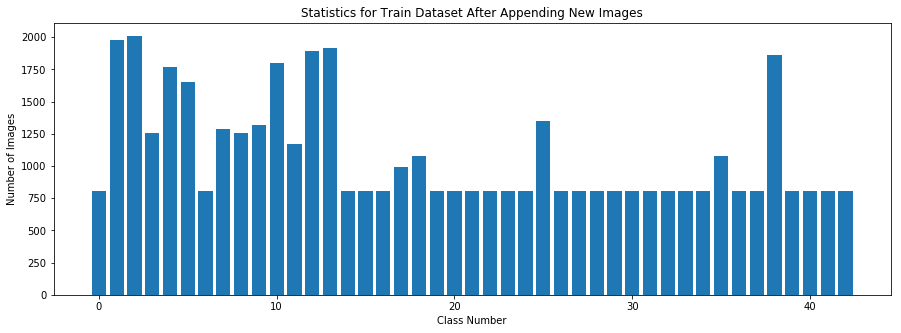

# Self-Driving Car Engineer Nanodegree

## Deep Learning

## Project: Build a Traffic Sign Recognition Classifier

The goals / steps of this project are the following:
* Load the data set 
* Explore, summarize and visualize the data set
* Design, train and test a model architecture
* Use the model to make predictions on new images
* Analyze performance of the model

## Step 0: Load The Data
Provided German Traffic sign dataset is loaded and used in this project.

## Step 1: Dataset Summary & Exploration

### Provide a Basic Summary of the Data Set Using Python, Numpy and/or Pandas
Python and Numpy are used to provide statistical and visual representation of the data:

    Number of training examples = 34799
    Number of validation examples = 4410
    Number of testing examples = 12630
    Image data shape = (32, 32, 3)
    Number of classes = 43
    

### Include an exploratory visualization of the dataset
Number of available samples for each of the 43 sign classes in the train, validation and test data is provided here. Also, first sample of each class is illustrated.

    Minimum number of images per class in the training data set= 180
    Maximum number of images per class in the training data set= 2010
    

    Minimum number of images per class in the validation data set= 30
    Maximum number of images per class in the validation data set= 240
    

    Minimum number of images per class in the testing data set= 60
    Maximum number of images per class in the testing data set= 750
    

## Pre-processing the Data
As above figures showed, some classes contain limited data in the training data set. To better train the model, additional data is generated and appended to the training dataset.
Additional data is generated to compensate for labels with minimal data. Number of additional images is determined based on distance to the mean of data for all classes.

Rotation angles for additional data
rotations = [-20, -15, -10, -5, 5, 10, 15, 20]

----

## Step 2: Design and Test a Model Architecture

### Pre-process the Data Set (normalization, grayscale, etc.)

Images are converted to grayscale and are normalized to pre-process the data. Normalization is crucial to have a homogeneous data set. Grayscaling is mainly used here to help with the speed of the algorithm.

Image shapes and means are shown here as well as an example of a grayscales and normalized image:

    Train Image Shape Before Processing = (46714, 32, 32, 3)
    Validation Image Shape Before Processing = (4410, 32, 32, 3)
    Test Image Shape Before Processing = (12630, 32, 32, 3)
    
    Mean for Train Data Before Processing: 81.0233353923
    Mean for Validation Data Before Processing: 83.5564273756
    Mean for Test Data Before Processing: 82.1484603612
    
    Images Converted to Gray.
    
    Images Normalized.
    
    Train Image Shape After Normalizing = (46714, 32, 32, 1)
    Validation Image Shape After Processing = (4410, 32, 32, 1)
    Test Image Shape After Processing = (12630, 32, 32, 1)
    
    Mean for Train Data After Processing: -0.373196943822
    Mean for Validation Data After Processing: -0.353489169512
    Mean for Test Data After Processing: -0.365019658588
    

### Model Architecture
CNN model based on the LeNet architecture is used in this project. First, the exact same LeNet model used in the classroom was tested. I could not reach validation accuracy of more than 90% after several trials for model parameters.

Consequently, I added more convolution layers, one more fully connected layer, included dropout.

Final model consisted of the following layers:

| Layer         		|     Description	        					| 
|:---------------------:|:---------------------------------------------:| 
| Input         		| 32x32x1 Grayscale image   		    		| 
| Convolution 3x3     	| 1x1 stride, same padding, outputs 30x30x8 	|
| RELU					|												|
| Dropout				|                   							|
| Convolution 7x7     	| 1x1 stride, same padding, outputs 24x24x16 	|
| RELU					|												|
| Max pooling	      	| 2x2 stride,  outputs 12x12x16 				|
| Convolution 3x3     	| 1x1 stride, same padding, outputs 10x10x25 	|
| RELU					|												|
| Dropout				|                   							|
| Fully connected		| 500 outputs  									|
| RELU					|												|
| Dropout				|                   							|
| Fully connected		| 100 outputs  									|
| RELU					|												|
| Fully connected		| 43 outputs  									|
| Softmax				|              									|

### Train, Validate and Test the Model

A validation set is used to assess how well the model is performing. To better train the model, training data is shuffled. Model and training details are as follows:
* Epochs: 30 Epochs are uses to train the model. I could not get validation accuracy of greater than 93 when originally trained the model for less epochs.
* Batch Size: Batch size is set to 200
* Learning rate: A variable learning rate is used based on epoch number, learnrate = 0.001 * pow(0.99,i), to help the model train faster at earlier epochs and avoid overfitting at later epochs
* Optimizer: Adam Optimizer is used as explained in the classroom

Loss and accuracy for training and validation data is illustrated in the following graphs:

Final accuracy for the train, validation and test data is as follows:

    
    Training Accuracy = 0.992
    Validation Accuracy = 0.958
    Test Accuracy = 0.942
    

---

## Step 3: Test a Model on New Images
Five German traffic signs found on the web are used here to test the model on new data. To challenge the model, images with background, poor resolution, noise, blurines and poor contrast with the background were considered:

### Predict the Sign Type for Each Image
The trained LeNet architecture is used to predict the class for the five images. 

### Analyze Performance

    Model Accuracy on the 5 New Images = 80.0 %
 
 The model was able to correctly guess 4 of the 5 traffic signs, as summarized below, which gives an accuracy of 80%. This is less than training, validation and testing accuracies. I expected this kind of performance as the new images are not from the original German Traffic Signs data set and I also tried to find challenging images (some with background, some with low resolution) to better analyze the performance of my model and learn from it. 
 
 Prediction results are as follows:
 
| Image		            |     Prediction	        					| 
|:---------------------:|:---------------------------------------------:| 
| Speed Limit (60km/h)  | Speed Limit (60km/h)  						| 
| Stop       			| Stop  										|
| Ahed Only				| Ahed Only										|
| Bumpy Road      		| Bumpy Road					 				|
| End of no Passing		| No Passing        							|
 
 For the "Speed Limit (60km/h)" image, the model classified it correctly with a very high softmox probability. Other top four predictions are all speed limit-related predictions which was expected as the speed limit signs share many similar features.
 
 For the "Stop" image, I used a noisy image but the model successfully classified it. It is interesting that "Speed Limit (60 km/h)" is one of the top 5 predictions. I think this is due to the similarity of "0" and "O" in the middle of these two images.
 
 For the "Ahead Only" image, I chose a tilted image to challenge the model. However, the model correctly classifed this sign. 
 
 For the "Bumpy Road" image, I used a low quality image with background. Model predicted it correctly and the top softmox probability for this image is still high, but the certainty of the model is lower for this compared to previous cases as shown in the bar charts.
 
 For the "No Passing", I used the most challenging image compared to all previous cases. The image is noisy, with poor quality and poor contrast with the background. These led to thhe model incorrectly predicting the "End of No Passing" sign as a "No Passing" sign, although "End of No Passing" had the second highest softmox probability. Another reason reason for the incorrect prediction could be attributed to small number of "End of No Passing" images in the training data set. Also, using color images rather than grayscale images might help to better distinguish between these two signs.

Softmox probabilities for all of the 5 imaages are shown in the bar charts. Reporting them here again for completeness:
 

